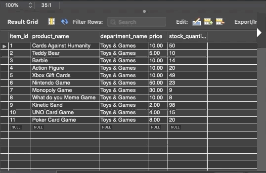

# Bamazon App

## Bamazon will take in orders from customers and deplete stock from the store's inventory following any sale.

This **_*CLI*_** application is a great example of **_MySQL_**, **_Inquirer_** and **_Node_** npm packages for storage and data input.

**_MySQL database_** Connectivity and real-time updating of stock quantity after a customer places any order.

